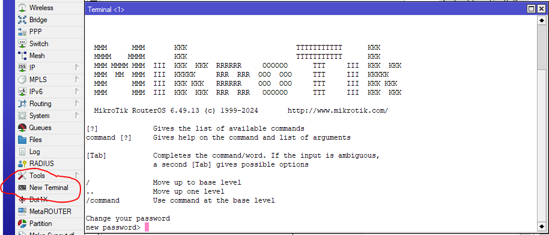
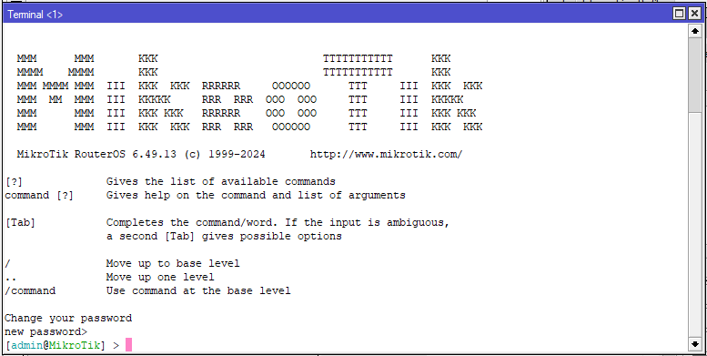
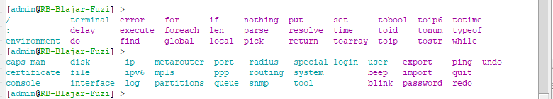
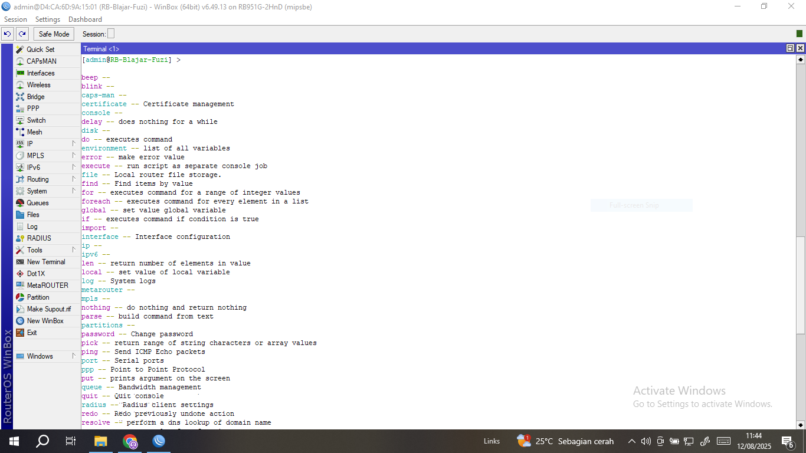
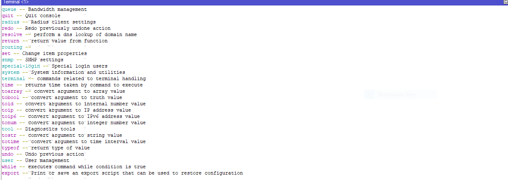

# LAB-4
tanggal 12 agustus 2025
# Command Line Interface [terminal] pada mikrotik
selain merimote mikrotik dengan mode GUI kita juga bisa dengan cara CLI Command Line Interface [terminal].  
Bisa di akses via winbox terminal, webfig terminal, putty, mikrotik pro untuk smartphone. 

conoh :  
via winbox terminal
 

    untuk memulai configurasi tekan ctrl+c 
 

# beberapa perintah CLI dasar:  
1. jika kalian ingin memasukan dhcp-client maka commadnya:
   
        ip dhcp-client add interface=ether1 use-peer-dns=yes use-peer-ntp=yes add-default-route=yes disabled=no
   
2. mengganti identitas mikrotik:

       system identity set name=(RB-Blajar-Fuzi)
   
3. melihat interfaces:

        interface print
   
4. mengganti nama interfaces:

       interface set name=(ether1-ISP) ether1

5. melihat ip address:
  
        ip address print / ip ad pr
    
6. menambahkan ip address:
 
        ip address add address=10.10.10.1/24 interfaces=(ether2)
    
7. melihat Gateway:

        ip route print
    
8. menambahkan Gateway:

        ip route add gateway=10.10.2.1
    
9. melihat DNS:

        ip dns print

10. menambahkan DNS:

        ip dns set server=8.8.8.8(ip google) allow-remote-requests=yes
    
11. menambahkan perintah NAT:

        ip firewall nat add chain=srcnat action=masquerade out-interfaces=ether1-ISP

    
12. melihat configurasi NAT:

        ip firewall nat prnit
    
13. Membuat user baru dan password dengan hak akses full:

        user add name=fuzi group=full password=fuzi123
    
14. melihat user:

        user prnit
    
15. melihat lisensi:

        system license prnit

16. menambahkan dhcp-server:

        ip dhcp-server add
        isi ether dengan tujuan kalian

# meliat commad yang tersedia 
Nah, jika kita lupa saat sedang konfigurasi,kalian bisa mengunakan key/tombol TAB di keyboard (disamping Q)   
untuk melihat command list/daftar perintah yang bisa digunakan.

dan untuk ? kita bisa melihat perintah dengan pengertian nya. 

    
   

